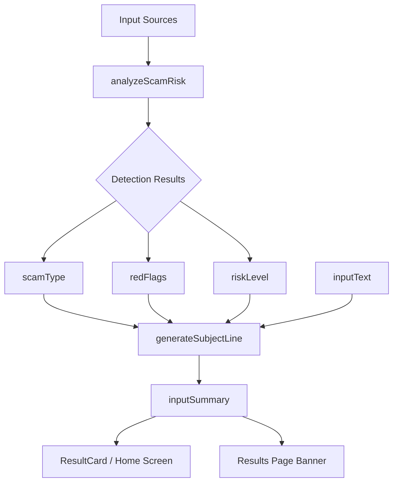
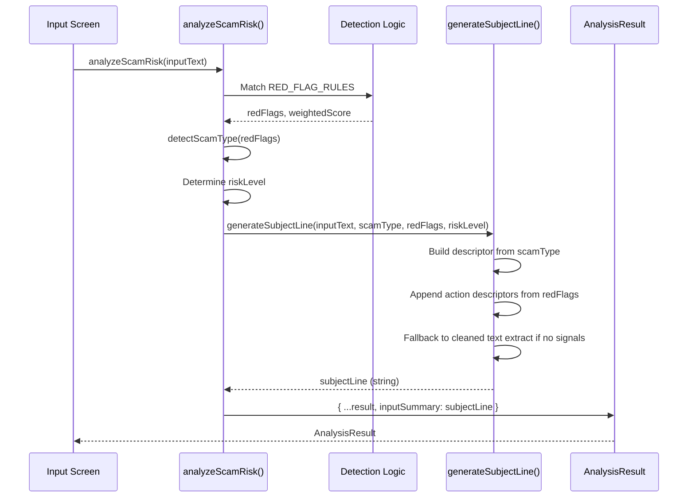
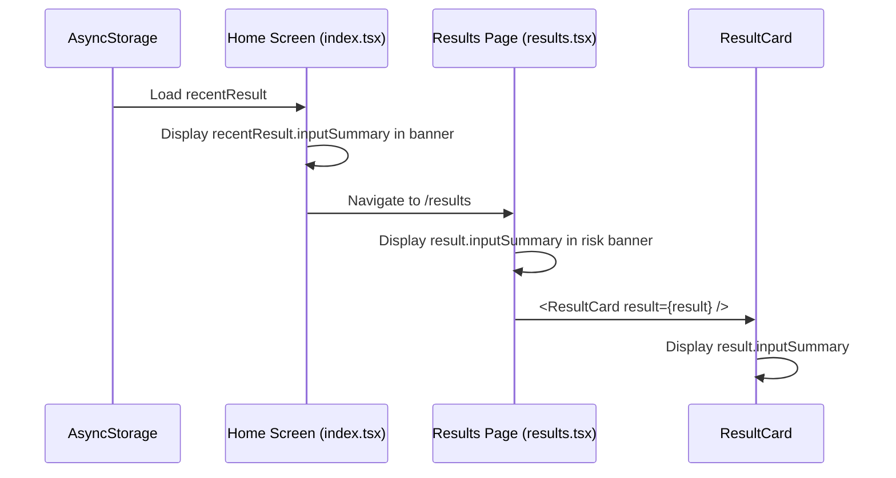

# Design Document: Smart Subject Lines

## Overview

The TrustPause app currently generates `inputSummary` by truncating the first 100 characters of raw input text (`inputText.slice(0, 100)`). When images are uploaded, OCR output often starts with random numbers, headers, or garbled text, producing nonsensical summaries like "123456 Dear Customer Your acc..." on both the home screen preview and the full results page.

This feature replaces the naive truncation with an intelligent subject line generator that leverages the existing scam detection results — detected `scamType`, `redFlags`, and `riskLevel` — to produce meaningful, descriptive summaries. For example, instead of garbled OCR output, the summary would read "Bank impersonation asking for account details". The generator operates entirely on already-computed analysis data plus lightweight text extraction, requiring no external API calls or AI models.

The design follows a pure-function approach: a single `generateSubjectLine` function takes the input text and the already-detected analysis signals, and returns a clean subject line string. This keeps the change minimal and fully testable.

## Architecture



The `generateSubjectLine` function sits between the existing detection logic and the final `AnalysisResult` construction. It receives the same signals that `analyzeScamRisk` already computes, so there is no additional pattern matching or text scanning cost.

## Sequence Diagrams

### Main Flow: Analysis with Smart Subject Line



### Display Flow: Home Screen and Results Page



## Components and Interfaces

### Component 1: generateSubjectLine (New Function)

**Purpose**: Produces a human-readable subject line from analysis signals and input text.

**Interface**:
```typescript
interface SubjectLineInput {
  inputText: string;
  scamType: ScamType;
  redFlags: RedFlag[];
  riskLevel: RiskLevel;
}

function generateSubjectLine(input: SubjectLineInput): string;
```

**Responsibilities**:
- Map `scamType` to a human-readable entity descriptor (e.g., `bank_impersonation` → "Bank impersonation")
- Map `redFlags` to action descriptors (e.g., `otp_request` → "asking for verification code")
- Combine entity + action into a concise subject line
- Fall back to cleaned text extraction when no scam signals are detected
- Enforce a maximum length of 120 characters with ellipsis truncation
- Never return an empty string

### Component 2: analyzeScamRisk (Modified)

**Purpose**: Existing analysis engine, modified to call `generateSubjectLine` instead of `inputText.slice(0, 100)`.

**Interface** (unchanged):
```typescript
function analyzeScamRisk(inputText: string): AnalysisResult;
```

**Change**: Replace `inputSummary: inputText.slice(0, 100)` with:
```typescript
inputSummary: generateSubjectLine({
  inputText,
  scamType,
  redFlags: uniqueFlags,
  riskLevel,
}),
```

### Component 3: Display Components (Unchanged Interface)

**Purpose**: `ResultCard`, `index.tsx` banner, and `results.tsx` banner all read `result.inputSummary` — no interface changes needed. The improved content flows through automatically.

## Data Models

### ScamType to Entity Label Mapping

```typescript
const SCAM_TYPE_LABELS: Record<ScamType, string> = {
  bank_impersonation: 'Bank impersonation',
  grandparent_scam: 'Family emergency scam',
  medicare_government: 'Government impersonation',
  amazon_delivery: 'Delivery/shopping scam',
  tech_support: 'Tech support scam',
  irs_tax: 'IRS/tax scam',
  lottery_prize: 'Lottery/prize scam',
  romance_scam: 'Romance scam',
  unknown: '',
};
```

### RedFlag to Action Label Mapping

```typescript
const ACTION_LABELS: Partial<Record<RedFlag, string>> = {
  money_transfer: 'requesting money transfer',
  gift_card: 'asking for gift cards',
  otp_request: 'asking for verification code',
  password_request: 'asking for password',
  ssn_medicare_request: 'requesting personal ID numbers',
  remote_access_request: 'requesting computer access',
  urgency: 'using urgent pressure',
  secrecy: 'demanding secrecy',
};
```

**Validation Rules**:
- `SCAM_TYPE_LABELS` must have an entry for every `ScamType` value
- `ACTION_LABELS` entries are optional — only the most descriptive flags need labels
- Labels must be lowercase sentence fragments (no leading capital except proper nouns)
- Labels should be ≤ 40 characters each

### Subject Line Construction Rules

| Scenario | Template | Example |
|----------|----------|---------|
| Known scam + action flags | `"{entity} — {action1}, {action2}"` | "Bank impersonation — requesting money transfer, using urgent pressure" |
| Known scam, no action flags | `"{entity}"` | "Tech support scam" |
| Unknown scam + action flags | `"Suspicious message — {action1}, {action2}"` | "Suspicious message — asking for gift cards, demanding secrecy" |
| Unknown scam, no action flags, has text | `"{cleaned first sentence or phrase}"` | "Your account has been compromised" |
| Probably Safe, has text | `"{cleaned first meaningful phrase}"` | "Meeting reminder for Thursday" |
| Empty/whitespace input | `"Empty message"` | "Empty message" |


## Algorithmic Pseudocode

### Main Algorithm: generateSubjectLine

```typescript
function generateSubjectLine(input: SubjectLineInput): string {
  const { inputText, scamType, redFlags, riskLevel } = input;

  // Step 1: Get entity descriptor from scam type
  const entity: string = SCAM_TYPE_LABELS[scamType] ?? '';

  // Step 2: Collect action descriptors from red flags (max 2)
  const actions: string[] = [];
  for (const flag of redFlags) {
    const label = ACTION_LABELS[flag];
    if (label !== undefined) {
      actions.push(label);
    }
    if (actions.length >= 2) break;
  }

  // Step 3: Compose subject line from entity + actions
  let subjectLine = '';

  if (entity !== '') {
    if (actions.length > 0) {
      subjectLine = `${entity} — ${actions.join(', ')}`;
    } else {
      subjectLine = entity;
    }
  } else if (actions.length > 0) {
    subjectLine = `Suspicious message — ${actions.join(', ')}`;
  }

  // Step 4: Fallback to cleaned text extraction
  if (subjectLine === '') {
    subjectLine = extractCleanPhrase(inputText);
  }

  // Step 5: Enforce max length
  if (subjectLine.length > 120) {
    subjectLine = subjectLine.slice(0, 117) + '...';
  }

  return subjectLine;
}
```

**Preconditions:**
- `input.inputText` is a string (may be empty)
- `input.scamType` is a valid `ScamType` enum value
- `input.redFlags` is an array of valid `RedFlag` values (may be empty)
- `input.riskLevel` is a valid `RiskLevel` value

**Postconditions:**
- Returns a non-empty string
- Return value length ≤ 120 characters
- If `scamType !== 'unknown'`, the return value contains the scam type label
- If `scamType === 'unknown'` and `redFlags` is non-empty, return value starts with "Suspicious message"
- If no detection signals exist, return value is derived from input text or is "Empty message"

**Loop Invariants:**
- `actions.length <= 2` at all times during the red flags iteration
- All entries in `actions` are non-empty strings from `ACTION_LABELS`

### Helper Algorithm: extractCleanPhrase

```typescript
function extractCleanPhrase(text: string): string {
  // Step 1: Handle empty/whitespace input
  const trimmed = text.trim();
  if (trimmed === '') return 'Empty message';

  // Step 2: Remove common OCR noise patterns
  let cleaned = trimmed
    .replace(/^[\d\s\-\.\,\#\*\=\_\+\|]+/, '')  // Leading numbers/symbols
    .replace(/\n+/g, ' ')                          // Newlines to spaces
    .replace(/\s{2,}/g, ' ')                       // Collapse whitespace
    .trim();

  // Step 3: If cleaning removed everything, use original
  if (cleaned === '') {
    cleaned = trimmed.replace(/\n+/g, ' ').replace(/\s{2,}/g, ' ').trim();
  }

  // Step 4: Extract first sentence or meaningful phrase
  const sentenceEnd = cleaned.search(/[.!?]\s/);
  if (sentenceEnd > 0 && sentenceEnd <= 100) {
    return cleaned.slice(0, sentenceEnd + 1);
  }

  // Step 5: Truncate at word boundary
  if (cleaned.length <= 100) return cleaned;
  const truncated = cleaned.slice(0, 100);
  const lastSpace = truncated.lastIndexOf(' ');
  if (lastSpace > 50) {
    return truncated.slice(0, lastSpace) + '...';
  }
  return truncated + '...';
}
```

**Preconditions:**
- `text` is a string (may be empty or whitespace-only)

**Postconditions:**
- Returns a non-empty string
- Return value length ≤ 103 characters (100 + "...")
- If input is empty/whitespace, returns "Empty message"
- Leading numeric/symbol noise is stripped when possible
- Result is a single line (no newline characters)

**Loop Invariants:** N/A (no loops)

## Key Functions with Formal Specifications

### Function 1: generateSubjectLine()

```typescript
function generateSubjectLine(input: SubjectLineInput): string
```

**Preconditions:**
- `input` is non-null and conforms to `SubjectLineInput` interface
- `input.scamType` ∈ `ScamType` (one of the 9 defined values)
- `input.redFlags` is a valid array (may be empty, no duplicates expected)
- `input.riskLevel` ∈ `RiskLevel` (one of 3 defined values)

**Postconditions:**
- Returns a non-empty string with length ≤ 120
- The return value does not contain newline characters
- If `scamType` is a known type (not `'unknown'`), the scam type label appears in the result
- If only action flags are present (unknown scam type), result starts with "Suspicious message"
- If no signals detected and input is empty, returns "Empty message"

### Function 2: extractCleanPhrase()

```typescript
function extractCleanPhrase(text: string): string
```

**Preconditions:**
- `text` is a string (may be empty)

**Postconditions:**
- Returns a non-empty string with length ≤ 103
- Leading OCR noise (digits, symbols) is removed when it doesn't consume the entire string
- Newlines are replaced with spaces
- Multiple consecutive spaces are collapsed to single spaces
- If a sentence boundary is found within 100 chars, result ends at that boundary

## Example Usage

```typescript
// Example 1: Bank impersonation with action flags
const result1 = generateSubjectLine({
  inputText: '123456 Dear Customer Your account has been compromised...',
  scamType: 'bank_impersonation',
  redFlags: ['impersonation_bank', 'urgency', 'password_request'],
  riskLevel: 'High Risk',
});
// → "Bank impersonation — asking for password, using urgent pressure"

// Example 2: Known scam type, no action-specific flags
const result2 = generateSubjectLine({
  inputText: 'Your grandson has been in an accident...',
  scamType: 'grandparent_scam',
  redFlags: ['impersonation_family'],
  riskLevel: 'High Risk',
});
// → "Family emergency scam"

// Example 3: Unknown scam type with action flags
const result3 = generateSubjectLine({
  inputText: 'Please send money immediately via wire transfer',
  scamType: 'unknown',
  redFlags: ['money_transfer', 'urgency'],
  riskLevel: 'High Risk',
});
// → "Suspicious message — requesting money transfer, using urgent pressure"

// Example 4: Probably safe, clean text
const result4 = generateSubjectLine({
  inputText: 'Hi, just checking in about our meeting on Thursday.',
  scamType: 'unknown',
  redFlags: [],
  riskLevel: 'Probably Safe',
});
// → "Hi, just checking in about our meeting on Thursday."

// Example 5: OCR garbage with no detection signals
const result5 = generateSubjectLine({
  inputText: '  \n123 456 789\n\nDear valued customer, your package is ready...',
  scamType: 'unknown',
  redFlags: [],
  riskLevel: 'Probably Safe',
});
// → "Dear valued customer, your package is ready..."

// Example 6: Empty input
const result6 = generateSubjectLine({
  inputText: '',
  scamType: 'unknown',
  redFlags: [],
  riskLevel: 'Probably Safe',
});
// → "Empty message"
```

## Correctness Properties

The following properties must hold for all valid inputs to `generateSubjectLine`:

1. **Non-empty output**: ∀ input ∈ SubjectLineInput: `generateSubjectLine(input).length > 0`

2. **Max length**: ∀ input ∈ SubjectLineInput: `generateSubjectLine(input).length <= 120`

3. **No newlines**: ∀ input ∈ SubjectLineInput: `generateSubjectLine(input).indexOf('\n') === -1`

4. **Scam type presence**: ∀ input where `input.scamType !== 'unknown'`: `generateSubjectLine(input)` contains `SCAM_TYPE_LABELS[input.scamType]`

5. **Suspicious fallback**: ∀ input where `input.scamType === 'unknown'` AND `actionFlags(input.redFlags).length > 0`: `generateSubjectLine(input)` starts with `"Suspicious message"`

6. **Empty input handling**: ∀ input where `input.inputText.trim() === ''` AND `input.scamType === 'unknown'` AND `input.redFlags.length === 0`: `generateSubjectLine(input) === "Empty message"`

7. **Deterministic**: ∀ input ∈ SubjectLineInput: calling `generateSubjectLine(input)` twice with the same input produces the same output

8. **Action limit**: The subject line contains at most 2 action descriptors from `ACTION_LABELS`

## Error Handling

### Error Scenario 1: Empty or Whitespace-Only Input Text

**Condition**: `inputText.trim() === ''` with no scam signals detected
**Response**: Returns `"Empty message"` as the subject line
**Recovery**: No recovery needed — this is a valid edge case

### Error Scenario 2: OCR Text is Entirely Numeric/Symbol Noise

**Condition**: After stripping leading noise, the cleaned text is empty
**Response**: Falls back to the original text with newlines/whitespace collapsed
**Recovery**: The original text is always preserved as a last resort

### Error Scenario 3: Unknown ScamType with No RedFlags

**Condition**: Detection engine found no patterns (likely safe message)
**Response**: Uses `extractCleanPhrase` to pull a meaningful excerpt from the raw text
**Recovery**: N/A — this is the expected path for safe messages

### Error Scenario 4: Very Long Input Text

**Condition**: Input text exceeds thousands of characters (e.g., full email paste)
**Response**: `extractCleanPhrase` only processes the first ~100 characters for the fallback path; the detection-based path doesn't depend on text length
**Recovery**: N/A — length is handled by design

## Testing Strategy

### Unit Testing Approach

Test `generateSubjectLine` and `extractCleanPhrase` as pure functions:

- **Known scam types**: Verify each `ScamType` value produces the correct label in the output
- **Action flag combinations**: Test with 0, 1, 2, and 3+ action flags to verify the 2-flag limit
- **Fallback path**: Test with `scamType: 'unknown'` and empty `redFlags` to verify text extraction
- **OCR noise**: Test with inputs starting with numbers, symbols, newlines
- **Empty input**: Verify `"Empty message"` is returned
- **Length enforcement**: Test with very long scam type + action combinations
- **Integration**: Verify `analyzeScamRisk` produces meaningful `inputSummary` for known scam patterns

### Property-Based Testing Approach

**Property Test Library**: fast-check

Properties to test with random inputs:
1. Output is always a non-empty string
2. Output length never exceeds 120 characters
3. Output never contains newline characters
4. Known scam types always appear in the output
5. Function is deterministic (same input → same output)

### Integration Testing Approach

- Verify that existing `analyzeScamRisk` tests still pass with the new `inputSummary` generation
- Verify that the `ResultCard` component renders the new-style summaries correctly
- Verify that the home screen banner displays the summary without layout issues

## Performance Considerations

- `generateSubjectLine` performs only string concatenation and a single regex-based cleanup — O(n) where n is bounded by the 120-char limit
- No additional pattern matching beyond what `analyzeScamRisk` already does
- No external API calls or async operations
- The function is called once per analysis, so performance is negligible

## Security Considerations

- The subject line is derived from user-provided text, which is already displayed in the UI. No new attack surface is introduced.
- The `extractCleanPhrase` function strips leading noise but does not sanitize for XSS — React Native's `<Text>` component handles this automatically.
- No user data is transmitted externally.

## Dependencies

- No new external dependencies required
- Uses existing `ScamType`, `RedFlag`, and `RiskLevel` types from `types/index.ts`
- Integrates into existing `analyzeScamRisk` function in `lib/analyzeScamRisk.ts`
